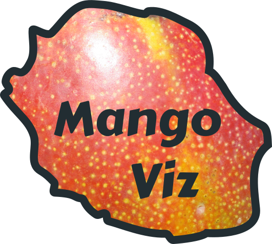

# MangoViz 

<!-- badges: start -->
[](https://www.tidyverse.org/lifecycle/)
<!-- badges: end -->

CIRAD dashboard for exploring long-term experiments on mango

------------------------------------------------------------------------

<!-- - Contact email: ipsim-chayote@cirad.fr   -->
<!-- - Developped at CIRAD by [Anna Doizy](doana-r.com), Isaure Païtard, Frederic Chiroleu and Jean-Philippe Deguine   -->
<!-- - Associated publication: [Qualitative modeling of fruit fly injuries on chayote in Réunion: Development and transfer to users](https://doi.org/10.1016/j.cropro.2020.105367)   -->

## Online usage

<!-- Just go to https://pvbmt-apps.cirad.fr/apps/ipsim-chayote/?lang=en. -->
<!-- English, French and Spanish versions are available. -->

## Local usage

You can install **{mangoviz}** R package from
[gitlab](https://gitlab.com/doana-r/mangoviz) with:

``` r
remotes::install_gitlab("doana-r/mangoviz")
```

Run this command to launch the app locally:

``` r
library(mangoviz)
run_app("en")

# or the french version:
run_app("fr")
```
